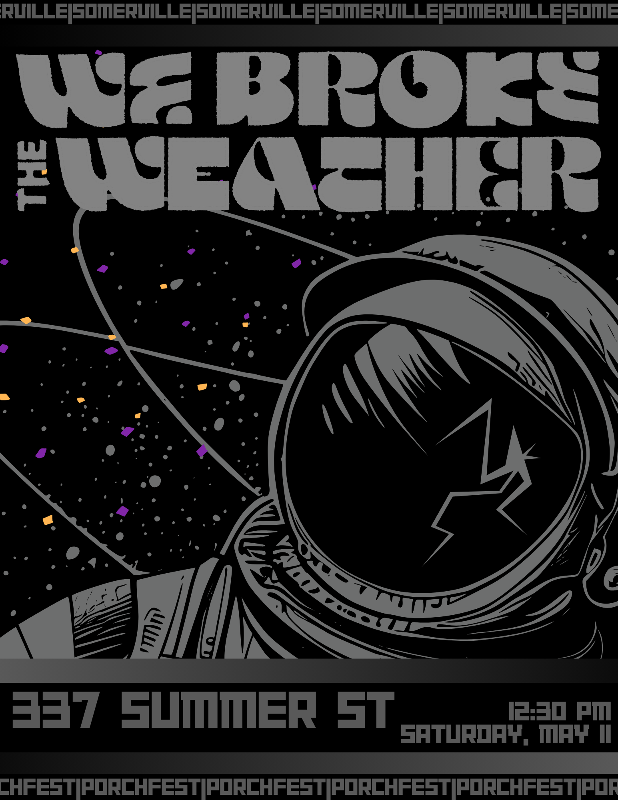
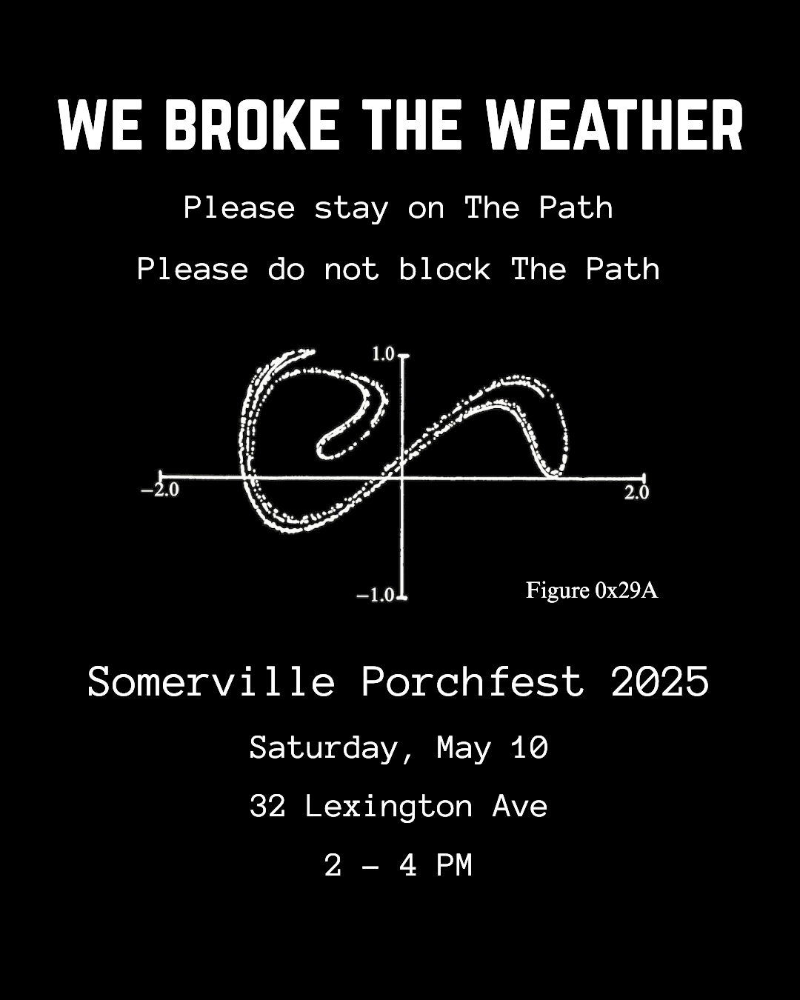
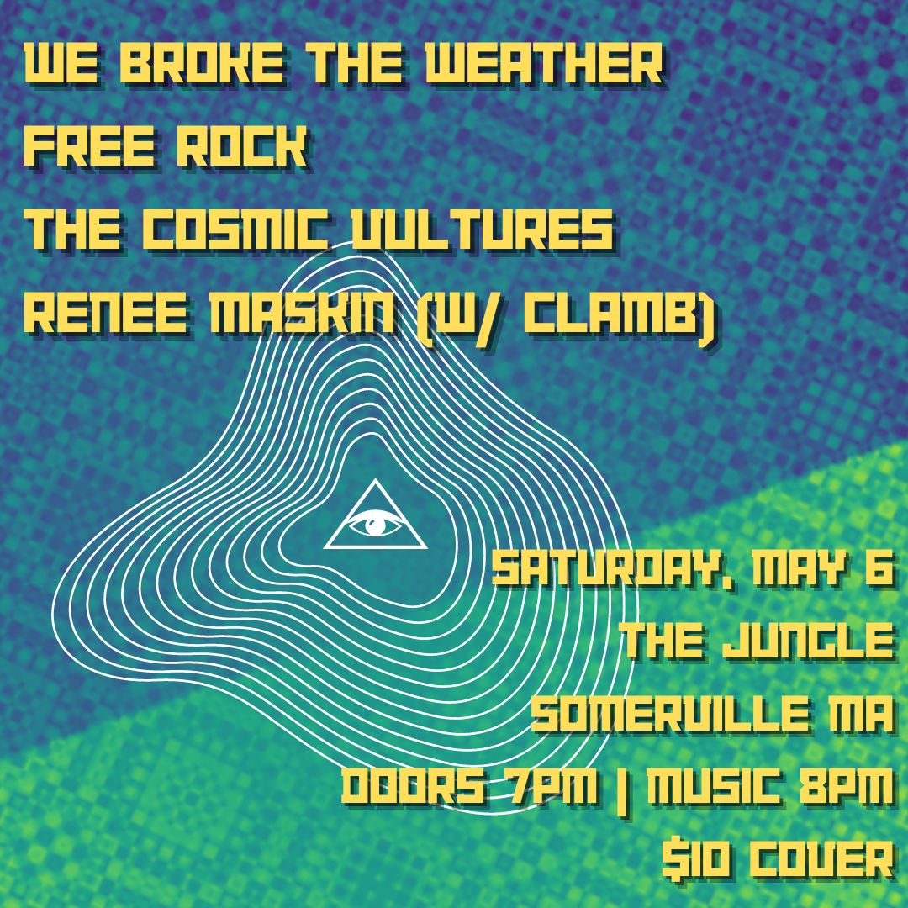

## we broke the weather

I've played bass and synth in we broke the weather since Spring 2019. We're a Somerville, MA based band drawing heavily from myriad progressive, psych, and indie rock influences (among many many more). Our first album was nominated for Boston Music Awards jazz album of the year in 2022.

<iframe style="border: 0; width: 100%; height: 120px;" src="https://bandcamp.com/EmbeddedPlayer/album=1268013263/size=large/bgcol=ffffff/linkcol=0687f5/tracklist=false/artwork=small/transparent=true/" seamless><a href="https://webroketheweather.bandcamp.com/album/we-broke-the-weather">we broke the weather by we broke the weather</a></iframe>

In 2024 we put out our second album, played (among other shows) a sold out Rockwell Theater supporting the band Maruja, and opened for David Cross (the violin player from the early 70s lineup of King Crimson, not the comedian).

<iframe style="border: 0; width: 100%; height: 120px;" src="https://bandcamp.com/EmbeddedPlayer/album=998747836/size=large/bgcol=ffffff/linkcol=0687f5/tracklist=false/artwork=small/transparent=true/" seamless><a href="https://webroketheweather.bandcamp.com/album/restart-game">Restart Game by we broke the weather</a></iframe>

Beyond bass and synth, I also do a fair amount of graphic design for the band.

## Solo works

Since getting deeper and deeper into synthesis and sound design after 2020, I've released two solo synth EPs---with more on the way.

<iframe style="border: 0; width: 100%; height: 120px;" src="https://bandcamp.com/EmbeddedPlayer/album=1990990511/size=large/bgcol=ffffff/linkcol=0687f5/tracklist=false/artwork=small/transparent=true/" seamless><a href="https://stevemuscari.bandcamp.com/album/descent">Descent by Steve Muscari</a></iframe>

<iframe style="border: 0; width: 100%; height: 120px;" src="https://bandcamp.com/EmbeddedPlayer/album=1060881550/size=large/bgcol=ffffff/linkcol=0687f5/tracklist=false/artwork=small/transparent=true/" seamless><a href="https://stevemuscari.bandcamp.com/album/sonar">Sonar by Steve Muscari</a></iframe>
